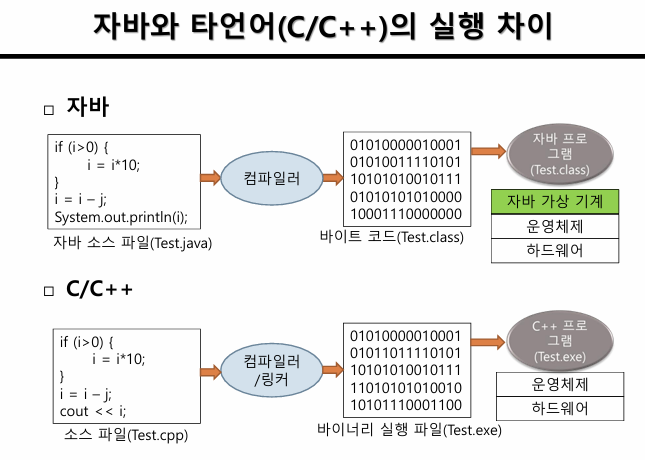
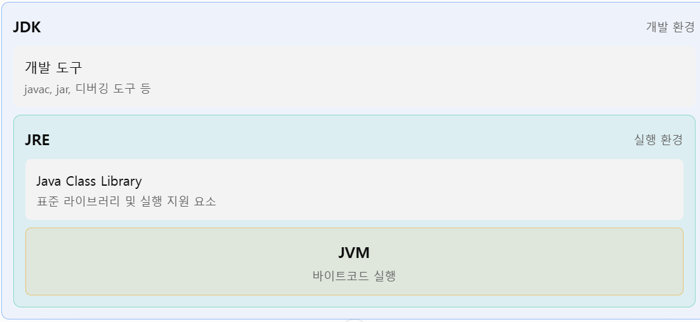
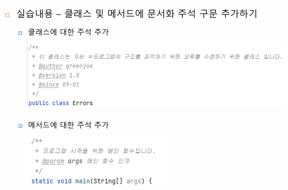
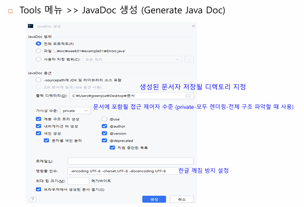

## 1주차 강의자료 정리

### 프로그래밍 언어의 역할 
- 사람과 컴퓨터 사이의 대화를 가능하게 하는 역할

### 프로그램 작성 언어
- 기계어(1,0), 어셈블리어(기계어 명령을 쉽게 표현), 고급언어(자바, C 등등)

### 컴파일
- 소스 파일을 컴퓨터가 이해할 수 있는 기계어로 만드는 과정  
    
        컴파일전 -> 컴파일 후
      자바 : .java -> .class(byte_code)(목적코드)
      C : .c -> .obj(목적코드) -> .exe(실행파일)
      C++ : .cpp -> .obj -> .exe

### 자바의 플랫폼 독립성
- 한번 작성된 코드는 모든 플랫폼에서 바로 실행되는 자바의 특징

      가능하게 하는 자바의 특징
      - JVM(Java Virtual Machine) : 동일한 자바 실행 환경 제공
      - 바이트 코드(byte code) : 자바 가상 기계에서 실행 가능한 바이너리 코드
      => 자바 가상 기계가 클래스 파일의 바이트 코드를 실행한다. => 플랫폼 독립성 보장

### 자바 개발 환경

    -JDK(Java Development Kit) : 자바 응용 개발 환경(컴파일러, JRE(Java Runtime Environment), 다양한 API 및 샘플 등 포함)
    -JRE(Java Runtime Environment) : 자바 실행 환경(JVM 포함)
    -JDK의 bin 디렉처리에 포함된 주요 개발 도구 : javac(자바 컴파일러), java(자바 응용프로그램 실행기)

### 자바 통합 개발 환경

    - IDE(Integrated Development Environment) : 통합 개발 환경(편집, 컴파일, 디버깅을 한번에 할 수 있는 통합된 개발 환경)
        - 이클립스
        - VScode
        - Intellij IDEA
    - 주의 : IDE는 통합 개발 환경으로 편집, 컴파일, 디버깅을 편리하게 도와주는 소프트웨어
            => 즉 JDK가 없으면 java 파일을 컴파일 할 수 없음)

### 자바 프로그램의 기본구조

    - public 클래스의 이름은 파일이름과 동일해야한다.
    - 자바 프로그램은 main()에서 실행을 시작한다.
    - 표준 출력 스트림으로 출력 (System.out.println)
    - 문서화 주석(아래 사진 참고)

### 데이터 타입

- 기본형 데이터 타입
  - boolean : 1byte
  - char : 2byte
  - byte : 1byte
  - short : 2byte
  - int : 4byte
  - long : 8byte
  - float : 4byte
  - double : 8byte
- 참조형 데이터 타입
  - String 클래스
  - 객체 변수

### 식별자 
- 변수, 상수, 매소드, 클래스 등에 붙이는 이름
- 카멜케이스(Camel Case) : 단어 연결 시 첫 글자(소문자)를 제외한 각 단어의 첫 글자를 대문자로 표기하는 명명 규칙 => 주로 변수나 함수의 이름을 지을 때 사용 (ex : myVariableName, calculateDiscountAmount)
- 파스칼케이스(Pascal Case) : 첫 단어의 첫 글자도 대문자로 표기하는 명명 규칙 => 주고 클래스나 타입의 이름을 지을 때 사용 (ex : MyClass, CalculateDiscountAmount)
- 상수 변수는 모두 대문자

### 상수 
- final을 사용하여 상수를 선언할 수 있다.

### 타입 변환
- 자동 타입 변환 : 컴파일러에 의해 원래의 타입보다 큰 타입으로 자동 변환
- 명시적 타입 변환 : 개발자의 의도적 타입 변환 
  -     double d = 1.9;
        int n = (int)d;  // n = 1

참고자료 : [1주차 강의자료](../pdf_summary/1주차-강의자료.pdf)