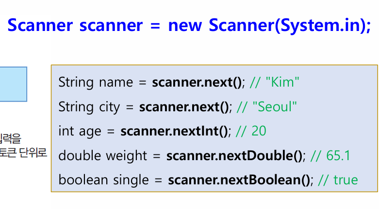
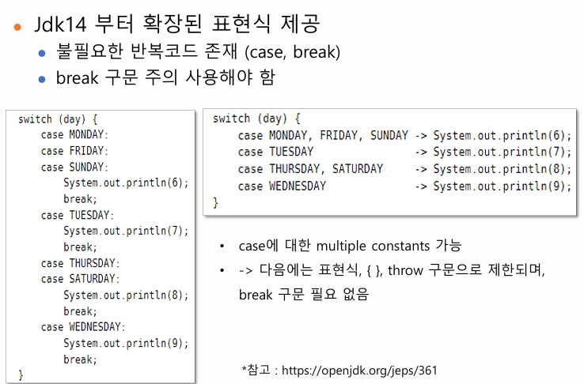

## 2주차 강의자료 정리

### 자바의 기본 입출력
- System : 표준 입력, 표준 출력 및 오류 출력 기능 제공
- 출력 : System.out.println
- 입력 : System.in.read() : end of stream(-1)을 만날 때까지 동작
  - 운영체제가 제공하는 표준 입력 스트림을 사용함
  - 입력되는 키를 바이트로 리턴하는 저수준 스트림 => 바이트를 문자나 숫자로 변환하는 많은 어려움이 있다.
  - 입력 스트림이 종료되면 키보드 입력을 받을 수 없음
  - IOException 예외처리 구문 포함해야 사용가능(왜? read함수가 예외를 던지도록 돼 있기 때문에)
  - 한번에 1byte를 읽어와서 느리다 => scanner 사용이유
- Scanner 클래스
  - 읽은 바이트를 문자, 정수, 실수, 불린, 문자열 등 다양한 타입으로 변환하여 리턴
  - JVM 내부의 입력버퍼를 사용한다
  - Scanner 클래스는 java.util 패키지 안에 있어서 import문을 통해서 import를 해줘야한다
    - 여기서 java.base에 대해 알아보자 java.base는 모듈(패키지를 모은거) 내부에 java.lang, java.io, java.math 등등 이 있지만 컴파일러가 자동으로 java.lang(패키지 : 관련된 클래스를 모은거)만 import를 해준다
  - Scanner은 코드 가독성이나 편리성 때문에 사용을 한다
  - 주의할 점 : 입력 버퍼에 남아있는 엔터로 인한 문제는 nextLine()을 써서 해결을 한다.
  - 참고자료 : [week02/example01/TestMain.java](../week02/example01/TestMain.java)
  
  
### 연산자
  - 조건 연산자 => 삼항연산자(op1?op2:op3) => op1이 참이면 op2를 거짓이면 op3를 실행한다.
  - 비트 논리 연산자 => a&b, a|b, a^b(xor), ~a => 비트를 바꾼다.
  - 시프트 연산자
    - a>>b : a의 각 비트를 오른쪽으로 b번 시프트, 최상위 비트는 시프트 전의 최상위 비트로(부호비트 유지, 산술적 오른쪽 시프트)
    - a>>>b : a의 각 비트를 오른쪽으로 b번 시프트, 최상위 비트는 0으로 채운다 (논리적 오른쪽 시프트)
    - a<<b : a의 각 비트를 왼쪽으로 b번 시프트, 최하위 비트는 0으로 채운다(산술적 왼쪽 시프트)
  - 논리 연산자와 단락 평가
    - 논리 연산 : boolean 값을 대상으로 연산한다.
    - 단락 평가(short-circut evaluation) : 앞의 식만으로 결과가 확정되면 뒤의 식은 평가하지 않는다 => 논리 연산자의 순서가 중요하다.

### 조건문
  - switch문
    - 표현식 확장
    - 

#### 반복문(for, while, do-while)
  - C와 동일
  - 주의할 점 : while문안에서 switch문을 써서 그 안에서 break를 쓰면 switch문만 빠져나오고 while문을 빠져나오지 않는다.
  - 어떻게 해결하냐? while문에 이름을 붙여서 break outer 또는 return문으로 매서드 종료
  - 참고자료 :[HW/ParkingArea.java 241 line](../HW/sanguk/ParkingArea.java#L241)
  - 중첩 반복문에서는 break를 쓰면 그 바로 위에 있는 반복문을 벗어난다.

참고자료 : [2주차 강의자료](../pdf_summary/2주차_강의자료.pdf)