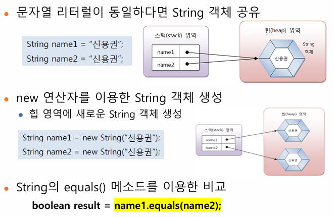

## 3주차 강의자료 정리

#### 참조타입
- 기본 타입 변수 : 실제 값을 변수 안에 저장
- 참조 타입 변수 : 주소를 통해 객체를 참조
- 메모리 사용 영역
  - JVM이 OS에서 할당 받은 메모리 영역(Runtime Data Area) => 부족하면 더 할당을 받음
    - Method 영역
      - 클래스 로더에 의해 로딩된 바이트 코드 내용 분석 후 저장(static, 클래스 정보, 필드 정보, 메서드 정보, 생성자 정보 등)
    - Heap 영역
      - 클래스의 객체나 배열 저장(스택 영역에서 참조)
    - Stack 영역
      - 각 스레드마다 하나씩 존재
      - 메소드 호출 시 프레임(frame)추가하고 종료되면 제거
        - 여기서 스택 프레임이란? : 메서드가 실행되는 동안 사용하는 메모리 공간(지역변수, Opread Stack(연산 중간값 저장하는 공간), 실행정보)
- 참조 변수의 ==, 1= 연산
  - 기본 타입 : 값이 같은지 확인
  - 참조 타입(배열, 열거, 클래스, 인터페이스) : 동일한 객체를 참조하는지 다른 객체를 참조하는지 조사(주소가 다르면 안에 값이 같아도 false가 나온다=> equal매소드를 사용하여 비교하면 값으로 비교를 한다)
  - 참고 자료 : [[HW/ParkingArea.java 185 line]](../HW/sanguk/ParkingArea.java#L185)
- null의 의미와 사용
  - 변수가 참조하는 객체가 없을경우 초기값으로 사용가능
  - 참조 타입의 변수에만 저장가능
  - null로 초기화된 참조 변수는 스택 영역에 생성이 된다(아직 heap과 연결이 없다)
  - NullPointerException 조심해야한다(참조하려는 변수가 null을 가지고 있을때 발생)
  
  
### 배열
- 데이터를 연속된 공간에 나열하고 각 데이터에 인덱스를 부여한 자료구조 (여기서 연속된 공간에 나열한다는게 중요 why? 연속된 메모리가 없으면 할당을 할 수 없다는 의미 => 이것 때문에 많은 일들을 수행해야한다.)
- 한번 생성된 배열은 길이를 늘리거나 줄일 수 없다 => 새로 배열을 만들어서 복사를 해야한다.
- 배열 선언
  - 타입[] 변수
    - int[] intArray
- 배열 생성
  - 값 리스트로 생성
    - 데이터타입[] 변수 = {값1, 값2...}
    - int[] intArray = {1,2,3,4,5};
  - 변수 선언 후 값 리스트 대입
    - 데이터타입[] 변수
    - 변수 = new 타입[]{값1, 값2...}
    - int[] intArray = null;
    - intArray = new int[]{1,2,3,4,5};
  - new 연산자로 배열 생성
    - 타입[] 변수 = new 타입[길이]
    - int[] intArray = new int[5];
    - 초기값은 전부 0으로 초기화(물론 타입에 따라 다르다.)
  - 크기의 동적 결정
    - 프로그램 실행중에 배열 크기를 동적으로 결정 할 수 있다.
  - 배열과 for-each문
    - 배열이나 나열의 원소를 순차 접근하는데 유용한 for문
    - for(변수 : 배열래퍼런스){..반복작업문..}
    - ```for(int k : n){sum+=k}```

